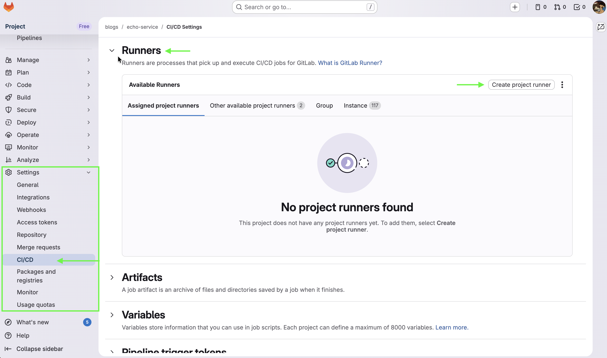
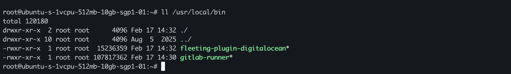
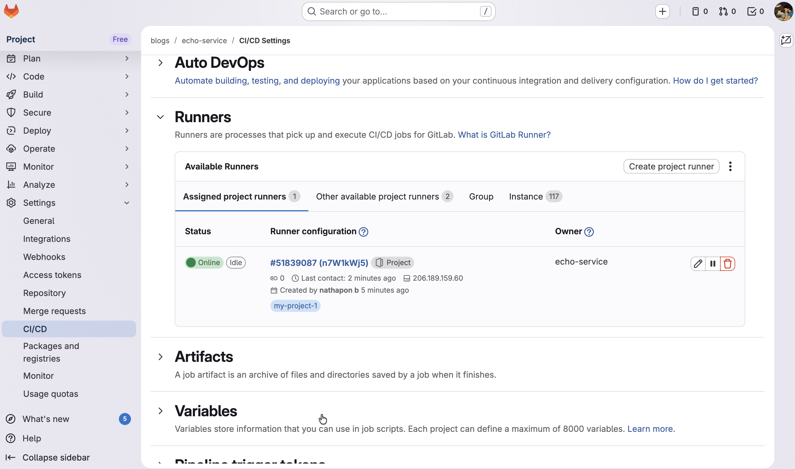
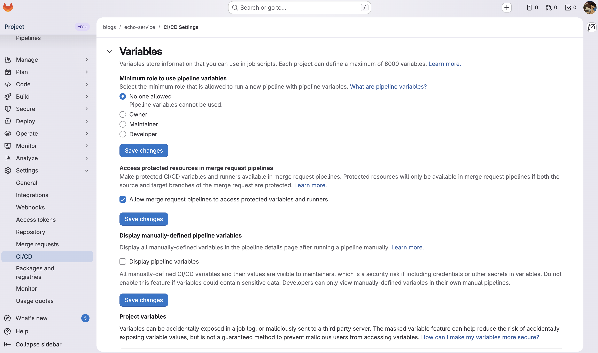
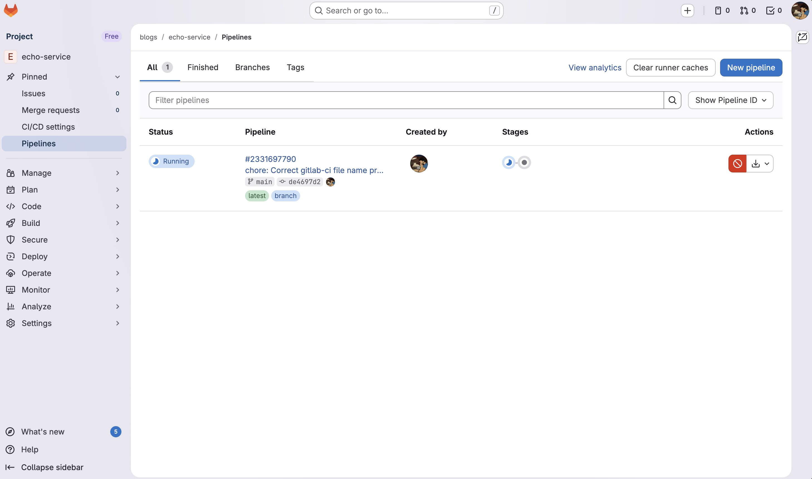
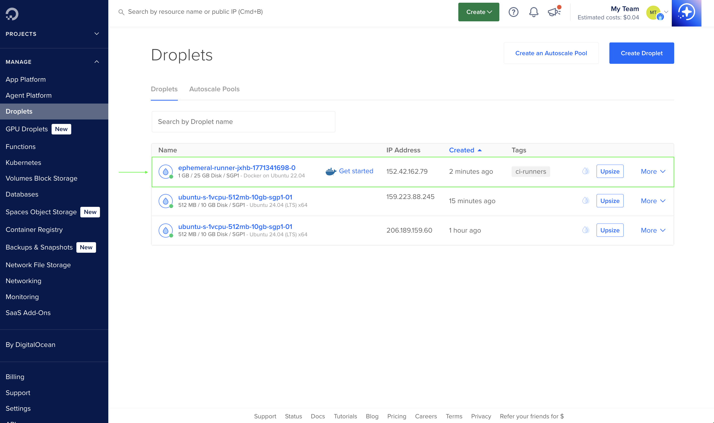
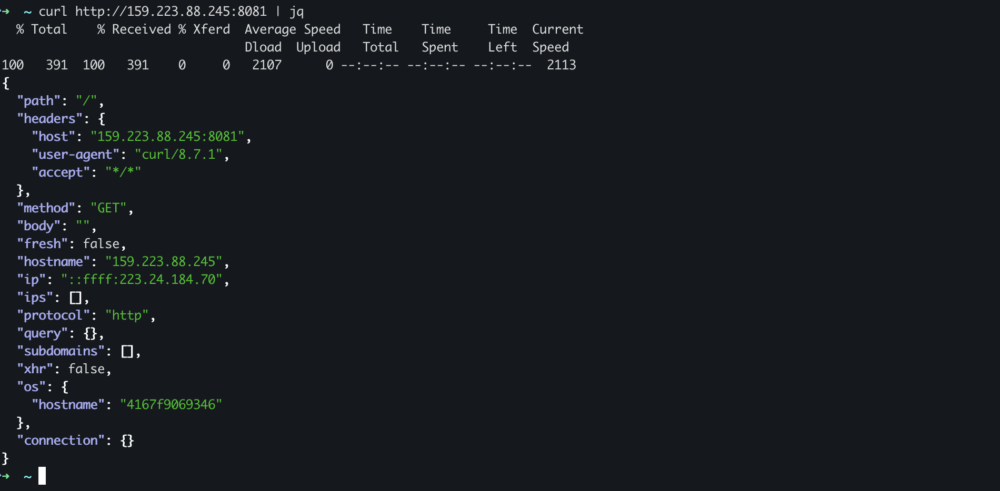

# บันทึกสิ่งที่ได้เรียนรู้จากการทำ Gitlab self-managed runners

## จุดเริ่มต้น
ผมเริ่มมองหาวิธีการทำ Self-managed Runners เพราะกำลังอยู่ในช่วงดีไซน์ระบบให้กับ Side Project ตัวหนึ่ง และแน่นอนว่าตัว CI/CD ถือเป็น Component สำคัญในส่วนของ Infrastructure ตามที่ได้ดีไซน์ไว้<br>
โดยปกติแล้ว Runners บน GitLab จะเป็น Runners ในรูปแบบการแชร์ทรัพยากรร่วมกับผู้ใช้อื่น (Shared Runner) ซึ่งในแง่ของเรื่อง Security แม้จะมีระบบการแยก Environment แต่การที่ Source Code หรือ Logs สำคัญต้องไปรันบนที่ที่เราไม่ได้ควบคุม 100% ก็อาจจะไม่ตอบโจทย์เรื่อง Privacy เท่าที่ควร<br> จุดนี้นี่เองที่ทำให้ผมตัดสินใจหันมาใช้ Self-managed Runner เพื่อให้สามารถกำหนดและควบคุมตัว Runner ได้ด้วยตัวเอง.

ในการสร้าง Runner นั้น สิ่งสำคัญคือเราต้องเลือก Executor ซึ่งเปรียบเสมือน 'Driver' ที่กำหนดว่างานใน Pipeline ของเราจะถูกรันด้วยสภาพแวดล้อมแบบไหน โดย GitLab มี Executor ให้เลือกใช้งานหลากหลายรูปแบบตามความเหมาะสมของ Infrastructure ของเรา อาทิ เช่น Docker, Kubernetes, Instance (Shell), Docker Autoscaler เป็นต้น

1. **Docker Executor** เป็น Executor ที่นำเอาเทคโนโลยี Container มาใช้ในการรัน CI/CD Jobs<br>
ข้อดี: คือการ Setup และการใช้งานนั้นตรงไปตรงมา ไม่ซับซ้อน<br>
ข้อเสีย: เนื่องจาก Container จะดึงทรัพยากร (CPU/RAM) มาจากเครื่อง Host โดยตรง ดังนั้นเราจึงจำเป็นต้องเตรียมสเปกเครื่อง VPS ให้เพียงพอต่อความต้องการของ Runner<br>
หากจัดสรรสเปกไม่ดี หรือรัน Jobs พร้อมกันหลายตัวจนทรัพยากรไม่พอ อาจส่งผลให้ CI/CD Pipeline ล่มหรือทำงานช้าลงได้<br> และแน่นอนว่าการเช่า VPS สเปกสูงๆไว้ เพื่อรองรับโหลดงานหนักๆ ก็ย่อมมีค่าใช้จ่าย ที่สูงตามมาด้วยเช่นกัน.

2. **Kubernetes Executor**: หาก Infrastructure ที่ผมดีไซน์ไว้มีการใช้ Kubernetes เป็น Base อยู่แล้ว ผมคงไม่ลังเลที่จะเลือกใช้ Executor ตัวนี้เลย<br>
ข้อดี: คือความสามารถในการใช้ Kubernetes Pods มารัน CI/CD Jobs ซึ่งสามารถ Scale Jobs ได้ตามจริงและคล่องตัวสุดๆ เพราะ Kubernates มีฟีเจอร์ Auto-scale ให้เองตามปริมาณงานที่เข้ามาในตอนนั้นเลย<br>
ข้อเสีย (ในบริบทของผม): คือความซับซ้อนในการ Setup เพราะผมไม่ได้วางแผนจะใช้ Kubernetes Cluster สำหรับโปรเจกต์นี้ตั้งแต่ต้น การต้องมาเซต Cluster เพียงเพื่อรัน Runner อย่างเดียวอาจจะดูเป็นการ 'ขี่ช้างจับตั๊กแตน' เกินไป ผมจึงตัดสินใจข้ามตัวเลือกนี้ไปครับ

3. **Instance Executor**: เป็น Executor ที่ใช้ Fleeting เพื่อติดต่อกับ Cloud Provider ในการสร้าง Instance Group (VPS/VM) ขึ้นมาใหม่แบบชั่วคราว (Ephemeral Runner) เพื่อใช้รัน Job โดยเฉพาะ<br>
ข้อดี: เป็นระบบ Auto-scaling ที่แท้จริง เพราะเครื่อง runner ย่อย จะถูกสร้างขึ้นมาเมื่อมีงาน และทำลายทิ้งเมื่อเสร็จงาน วิธีนี้ช่วยควบคุมค่าใช้จ่ายได้ตามการใช้งานจริง (Pay-per-use)<br>
ข้อเสีย: เนื่องจาก Instance ที่ถูกสร้างขึ้นมามักจะเป็น Bare VPS (เครื่องเปล่า) การจัดการ Environment หรือติดตั้ง Dependency ต่างๆ ให้พร้อมใช้งานตามที่ Pipeline ต้องการนั้นทำได้ยากและขาดความยืดหยุ่นพอสมควร<br>
ยกตัวอย่างเช่น: หากใน Pipeline ของเราต้องการ Library ตัวเดียวกันแต่คนละ Version การ Setup ลงบน OS ของ VPS โดยตรงจะเกิดความซับซ้อนที่ต้องจัดการ version ดีให้ดี ซึ่งไม่สะดวกเท่ากับการใช้ Docker Image ที่แยก Environment มาให้เรียบร้อยแล้วครับ

4. **Docker Autoscaler Executor**: นี่คือตัวเลือกที่นำข้อดีของ Docker และ Instance Executor มาประยุกต์เข้าด้วยกัน โดยยังคงใช้เทคโนโลยี Fleeting ในการจัดการ Auto-scaling ครับ<br>
จุดเด่น: คือการนำความสามารถของ Docker มาใช้แยก Environment และ Dependency ของแต่ละ Job ได้อย่างอิสระ (Isolation) ในขณะเดียวกันก็นำจุดเด่นของ Instance มาใช้ในการสร้าง VPS ขึ้นมาใหม่เป็น Ephemeral Runners (ตัวรันงานแบบชั่วคราว)<br>
ผลลัพธ์: ทำให้ CI/CD Jobs ของเราถูกรันบนเครื่องที่สร้างขึ้นมาใหม่เพื่อความปลอดภัยสูงสุด (Security) และเมื่อรันงานสำเร็จ เครื่องเหล่านั้นก็จะถูกลบทิ้งทันที เพื่อช่วยลดค่าใช้จ่าย (Cost Optimization)

<a id="fleeting-explain"></a>
>Fleeting คือ Library ที่ทำหน้าที่เป็นตัวกลาง (Abstraction Layer) ระหว่าง GitLab Runner และ Cloud Provider เพื่อจัดการเรื่อง Auto-scaling โดยเฉพาะ<br>
โดย Fleeting จะไม่ได้สื่อสารกับ Cloud Provider โดยตรง แต่จะใช้ Fleeting Plugin ซึ่งถูกรันขึ้นมาเป็น Sub-process อีกที (หรือจะมองว่าเป็น API Server เล็กๆ ที่รอรับคำสั่งจาก Fleeting ก็ได้)
ตัว Fleeting Plugin จะทำหน้าที่ implement interface ของ Fleeting ให้เข้ากับ API ของแต่ละ Cloud Provider นี่คือเหตุผลที่ Gitlab มี Support Plugin ให้เฉพาะ Cloud เจ้าใหญ่ๆ (เช่น AWS, GCP, Azure) เพราะต้องมีการเขียน Plug & Adapter เฉพาะตัวขึ้นมานั่นเอง<br>
_โดยเดิมที GitLab ใช้ Docker Machine ในการทำ Auto-scaling มาโดยตลอด แต่เนื่องจาก Docker Machine หยุดการพัฒนาและไม่มีการดูแลต่อ<br> GitLab จึงต้องหา Solution ของตัวเองขึ้นมาใหม่ในชื่อ ['Next Runner Auto-scaling Architecture'](https://handbook.gitlab.com/handbook/engineering/architecture/design-documents/runner_scaling/) เพื่อมาแทนที่และเพื่อตอบโจทย์การทำ auto scaling ต่อไป._<br>
[👉gitlab-fleeting-repository](https://gitlab.com/gitlab-org/fleeting/fleeting) 


## ปัญหา
หลังจากที่ผมตัดสินใจได้ว่า Docker Autoscaler Executor คือตัวเลือกที่ลงตัวที่สุด แต่เมื่อเริ่มลงลึกในรายละเอียดการติดตั้ง ผมกลับเจออุปสรรคสำคัญเข้าจนได้<br>
เพราะในปัจจุบัน GitLab มี Official Fleeting Plugin รองรับเฉพาะ Cloud Provider ยักษ์ใหญ่เท่านั้น เช่น AWS, Azure และ Google Cloud แต่สำหรับ Side Project หรือโปรเจกต์ขนาดกลางที่ผมทำอยู่เป็นประจำ ผมมักจะเลือกใช้ DigitalOcean เป็นหลัก<br>
ในตอนนี้ผมจึงมีทางเลือกอยู่ 2 ทาง:<br>
**ย้ายค่าย**: ยอมเปลี่ยนไปใช้ AWS หรือ Google Cloud เพื่อให้ Setup ได้ง่ายตามคู่มือ (แต่ก็ต้องแลกมาด้วยค่าใช้จ่ายและ Configuration ที่ซับซ้อนขึ้น)<br>
**สู้ต่อ**: ลองค้นหาว่ามีใครทำ Fleeting Plugin สำหรับ DigitalOcean ไว้บ้าง หรือถ้าแย่ที่สุด... ผมอาจจะต้องเขียน Plugin ขึ้นมาเองโดยการแกะ Source Code ของเจ้าอื่นมา Implement Interface ให้เข้ากับ DigitalOcean API<br>
แต่ในความโชคร้ายยังมีความโชคดีครับ เพราะหลังจากหาไปสักพัก ผมก็ไปเจอ Open-source project ที่มีคนทำ [DigitalOcean Fleeting Plugin](https://gitlab.com/bearx3f/fleeting-plugin-digitalocean) เตรียมไว้ให้เรียบร้อยแล้ว.

## ลงมือทำ
เมื่อหาข้อมูลพอสมควรแล้ว ทีนี้ก็เหลือแค่ลงมือทำ

### เตรียม GitLab Reposioty

* สร้าง Repository: เริ่มต้นด้วยการสร้างโปรเจกต์สำหรับเก็บ Source Code และไฟล์ CI/CD Pipeline ของเราให้เรียบร้อย
* สร้าง Runner บน GitLab UI: * ไปที่เมนู Settings > CI/CD แล้วขยายหัวข้อ Runners, กดปุ่ม New project runner กำหนดค่าเบื้องต้น:
* กำหนด Tag ให้กับ Runner ตัวนี้ (เช่น my-project-1) เพื่อให้เราสามารถระบุในไฟล์ .gitlab-ci.yml ได้ว่า Job ไหนจะให้ Runner ตัวนี้เป็นคนรัน
* เก็บ Token สำคัญ: หลังจากกด Create runner เราจะได้ Authentication Token (ขึ้นต้นด้วย glrt-) ให้คัดลอกและเก็บไว้ให้ดีครับ เพราะ GitLab จะแสดงให้เห็นแค่ครั้งเดียว และเราต้องใช้มันในขั้นตอน Configuration


### เตรียม VPS สำหรับ Runner Manager
* เตรียม API Token (แบบ Read/Write) เพื่อให้ Runner Manager ใช้ติดต่อกับ DigitalOcean ในการสร้างและลบ Ephemeral Runners โดยอัตโนมัติ<br>

* สร้าง VPS สำหรับ Manager Node: แม้ตัว Runner Manager จะไม่ได้รัน Job เอง แต่ต้องคอยจัดการคิวและรัน Docker สเปกที่เลือกเป็น s-1vcpu-512mb ($4/mo) อาจจะค่อนข้างตึงไปนิดสำหรับการรัน Docker + GitLab Runner ในระยะยาว หากเป็นไปได้แนะนำขยับเป็น 1GB RAM (s-1vcpu-1gb) จะเสถียรกว่าครับ
| Property | Value |
|---|---|
| Region | Singapore (sgp1) |
| Size | $4/month (s-1vcpu-512mb-10gb) |
| OS | Ubuntu (ubuntu-24-04-x64) |

> SSH เข้าไปใน VPS.

* ติดตั้ง docker https://docs.docker.com/engine/install/ubuntu/<br> _Docker Autoscaler เครื่อง Manager จำเป็นต้องมี Docker Engine เพื่อจัดการ Environment เบื้องต้น_

* ติดตั้ง GitLab Runner
```sh
# Download the binary for your system (amd64)
sudo curl -L --output /usr/local/bin/gitlab-runner https://gitlab-runner-downloads.s3.amazonaws.com/latest/binaries/gitlab-runner-linux-amd64

# Give it permission to execute
sudo chmod +x /usr/local/bin/gitlab-runner

# Create a GitLab Runner user
sudo useradd --comment 'GitLab Runner' --create-home gitlab-runner --shell /bin/bash

# Install and run as a service
sudo gitlab-runner install --user=gitlab-runner --working-directory=/home/gitlab-runner

sudo gitlab-runner start
```

* ต่อมา เราจำเป็นต้องมี ไฟล์ binary fleeting-plugin ของ digital ocean เนื่องจากที่ได้อธิบายไปในตอนต้นว่า gitlab runner ไม่ได้มี official fleeting plugin มาให้ ดังนั้น เราต้อง compile เองจาก source code<br>
โดยใช้วิธี [manual install](https://docs.gitlab.com/runner/fleet_scaling/fleeting/#:~:text=version%201.5.1.-,Install%20binary%20manually,-To%20manually%20install)<br>
```sh
export PACKAGE_REGISTRY_URL="https://gitlab.com/api/v4/projects/75321582/packages/generic/fleeting-plugin-digitalocean"

curl -sSL https://gitlab.com/bearx3f/fleeting-plugin-digitalocean/-/raw/main/install.sh | bash
```

>ไฟล์ binary fleeting-plugin ของ Digital Ocean fleeting-plugin จะถูก compile ไว้ที่ path ```/usr/local/bin```


* สร้างไฟล์ config.toml ที่ path /etc/gitlab-runner/config.toml
หากมีไฟล์อยู่แล้ว replace ทับได้เลย
```sh
# /etc/gitlab-runner/config.toml
concurrent = 4
check_interval = 3
connection_max_age = "15m0s"
shutdown_timeout = 0
[session_server]
session_timeout = 1800

    [[runners]]
        name = "DigitalOcean-Autoscaler-Runner"
        limit = 10
        url = "https://gitlab.com"
        token = "TOKEN-FROM-GITLAB" # ใส่ token ที่ generate จาก Gitlab repository
        executor = "docker-autoscaler"
        shell = "sh"
        [runners.docker]
            tls_verify = false
            image = "busybox:latest"
            pull_policy = "if-not-present"
            privileged = true
            disable_entrypoint_overwrite = false
            oom_kill_disable = false
            disable_cache = false
            shm_size = 0
            network_mtu = 0
            network_mode = "host"
            volumes = ["/var/run/docker.sock:/var/run/docker.sock"]
        [runners.autoscaler]
            plugin = "/usr/local/bin/fleeting-plugin-digitalocean"

            capacity_per_instance = 2
            max_use_count = 10
            max_instances = 10
        [runners.autoscaler.plugin_config]
            access_token = "DIGITAL-OCEAN-TOKEN" # ใส่ token ที่ generate จาก Digital Ocean
            image = "docker-20-04"
            instance_slug = "s-1vcpu-1gb"
            name = "ephemeral-runner"
            region_slug = "sgp1"
            ssh_private_key_file = "/cache/id_rsa"
            tag = "ci-runners"
        [runners.autoscaler.connector_config]
            protocol = "ssh"
            username = "root"
            keepalive = "10s"
            timeout = "10s"
            use_external_addr = false
        [[runners.autoscaler.policy]]
            idle_count = 0
            scale_factor = 1.0
            idle_time = "5m0s"
            scale_factor_limit = 5
```

* เปลี่ยน owner และเซต permission ให้ไฟล์ config.toml 
```sh
sudo chown root:root /etc/gitlab-runner/config.toml
sudo chmod 600 /etc/gitlab-runner/config.toml
```

* start gitlab-runner
```sh
sudo systemctl start gitlab-runner
sudo systemctl enable gitlab-runner
```

* เช็คว่า gitlab-runner รันปกติและสามารถเชื่อมต่อกับ Digital Ocean ได้
```sh
gitlab-runner status
sudo journalctl -u gitlab-runner -f
```


เช็คที่หน้า gitlab repository จะสังเกตได้ว่า ที่ runner มี status ขึ้นเป็น Online


gitlab พร้อม, runner พร้อม, digital ocean พร้อม
ที่นี้ runner ของเราก็พร้อมรัน ci/cd jobs แล้ว

### Push code และรัน Pipeline
เพื่อให้เห็นภาพการทำงานจริง ผมจะลองสร้างแอปพลิเคชันง่ายๆ แล้วให้ Runner ของเราสร้าง Ephemeral VPS ขึ้นมาเพื่อ Build และ Deploy งานไปยังเครื่องปลายทาง (Target Server) ครับ

>เตรียมเครื่องสำหรับ Deploy (Target Server)
ผมจะสร้าง VPS (Droplet) ขึ้นมาอีกหนึ่งตัวเพื่อทำหน้าที่เป็น Production Server ครับ โดยใช้ Docker เป็นการ Deploy ง่ายๆ

* สร้างไฟล์ Dockerfile<br>
แอปพลิเคชันที่ผมใช้ทดสอบคือ http-https-echo ซึ่งเป็น Image ที่ใช้สำหรับตรวจสอบ Request ที่ส่งเข้ามาครับ

```docker
FROM mendhak/http-https-echo:latest

EXPOSE 8080
```

* สร้างไฟล์ .gitlab-ci.yml
ในไฟล์นี้เราจะกำหนดให้ Pipeline มี 2 ขั้นตอนหลัก โดยอย่าลืมระบุ Tags ให้ตรงกับที่เราตั้งไว้ใน Runner (เช่น my-project-1) เพื่อให้มันไปเรียกใช้ Docker Autoscaler ครับ
```sh
stages:
  - docker_publish
  - deploy

default:
  image: docker:25
  tags:
    - my-project-1 # ใน่ชื่อ tag ให้ตรงกับที่สร้างไว้ในตอนต้น

docker_publish_image:
  stage: docker_publish
  script:
    - echo "--- Logging into GitLab Container Registry ---"
    - docker login -u $CI_REGISTRY_USER -p $CI_REGISTRY_PASSWORD $CI_REGISTRY
    - IMAGE_TAG=$CI_REGISTRY_IMAGE:$CI_COMMIT_SHORT_SHA
    - docker build -t $IMAGE_TAG .
    - docker push $IMAGE_TAG
  rules:
    - if: $CI_COMMIT_BRANCH == $CI_DEFAULT_BRANCH

deploy_to_droplet:
  stage: deploy
  image: alpine:latest
  script:
    - echo "--- Setting up SSH Access ---"
    - apk add --no-cache openssh-client coreutils
    - mkdir -p ~/.ssh
    # Using printf and -di to ensure the key is decoded perfectly
    - printf '%s' "$SSH_PRIVATE_KEY_B64" | base64 -di > ~/.ssh/id_rsa
    - chmod 600 ~/.ssh/id_rsa
    - eval "$(ssh-agent -s)"
    - ssh-add ~/.ssh/id_rsa
    - ssh-keyscan -H $TARGET_VPS_PRIVATE_IP >> ~/.ssh/known_hosts

    - echo "--- Deploying mendhak/http-https-echo to VPS ($TARGET_VPS_PRIVATE_IP) ---"
    - >
      ssh root@$TARGET_VPS_PRIVATE_IP "
        docker login -u ${CI_REGISTRY_USER} -p ${CI_REGISTRY_PASSWORD} ${CI_REGISTRY} &&
        docker pull ${CI_REGISTRY_IMAGE}:${CI_COMMIT_SHORT_SHA} &&
        docker stop my-echo-app || true &&
        docker rm my-echo-app || true &&
        # Note: Port 8081 on VPS -> Port 8080 inside the container
        docker run -d --name my-echo-app \
          -p 8081:8080 \
          --restart unless-stopped \
          ${CI_REGISTRY_IMAGE}:${CI_COMMIT_SHORT_SHA}
      "
  dependencies:
    - docker_publish_image
  rules:
    - if: $CI_COMMIT_BRANCH == $CI_DEFAULT_BRANCH
```

* ก่อนที่ จะ push โค๊ดไปที่ repo ผมจะ config ให้ repo มี secrets ต่างๆที่ต้องใช้ตามที่ระบุใน Pipeline ดังนี้นะครับ
| Key | Description |
|---|---|
| TARGET_VPS_PRIVATE_IP | Pubic IP ของเครื่อง Deploy |
| SSH_PRIVATE_KEY_B64 | ssh private key ของเรา โดยทำการ encode base64 |



เมื่อ Push code ขึ้นไปยัง Repository จะสังเกตได้ว่า Runner ของเราขึ้นสถานะทำงาน โดยมีการรัน pipeline เกิดขึ้น เราสามารถเข้าไป monitor logs ได้จาก เมนู Pipeline


- เช็ค หน้า Digital Ocean ว่า Ephemical runner ถูก scale down ลง เหลือเท่ากับจำนวน idle


- access vps deployed app ว่า app ถูก deploy ขึ้นจริงๆ



## Footnote
[^runner]: runner คือ agent ที่ execute หรือรัน ci/cd jobs ใน pipeline
[^executor]: executor คือ รูปแบบและเครื่องมือ ที่ใช้ในการรัน ci/cd jobs
[^ephemical-runner]: ephemical runner คือ runner ย่อย/เล็กๆ ที่ถูกสร้างขึ้นมาชั่วคราวเพื่อรัน job เมื่อรันเสร็จจะถูกลบออกไป