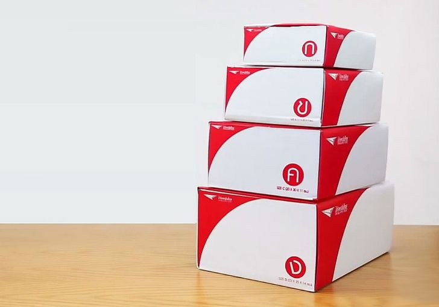

หากเปรียบเทียบกับ Array ที่ต้องกำหนดขนาดที่แน่นอนตั้งแต่แรก Slice ถือว่ามีความยืดหยุ่นกว่ามาก เพราะสามารถขยายขนาดได้เองในระหว่างการใช้งาน

แต่ความยืดหยุ่นนี้ก็อาจต้องแลกมาด้วย "ต้นทุนด้านประสิทธิภาพ" (Performance overhead) หากใช้งานโดยไม่ระวัง ยกตัวอย่างเช่น การใช้ฟังค์ชั่น append กับ slice ว่างซ้ำๆ ทั้งๆที่รู้จำนวนข้อมูลล่วงหน้า ก็อาจทำให้เกิดการจัดสรรหน่วยความจำ (Memory allocation) บ่อยๆ โดยไม่จำเป็น

ก่อนที่เราจะไปเจาะลึกเรื่องประสิทธิภาพของ Slice ผมอยากชวนทุกคนมาทบทวนความเข้าใจพื้นฐานของ Slice กันสักเล็กน้อยครับ<br>
Slice จริงๆเป็นเพียง metadata หรือ “ตัวอธิบายข้อมูล” ของ array ที่อยู่ภายในเท่านั้น หากนึกภาพไม่ออก ให้ลองจินตนาการถึง ใบสลิปส่งพัสดุ ดูก็ได้ครับ ใบสลิปนี้ไม่ได้เป็นพัสดุเอง แต่เป็นเพียงเอกสารที่บอกว่าในกล่องพัสดุของเรามีของกี่ชิ้น ขนาดกล่องเท่าไหร่ และสำคัญที่สุดคือมันสามารถใช้ อ้างอิงกลับไปถึงพัสดุจริงๆ ได้



*เพื่อให้เห็นภาพชัดเจนมากยิ่งขึ้น เราลองมาดูองค์ประกอบหลักของ Slice กัน*

## ส่วนประกอบของ Slice

Slice มีองค์ประกอบหลักอยู่ 3 อย่างด้วยกัน

1. **cap** (*capacity*) — ความจุของ slice แต่จริงๆคือมันขนาดของ array ที่ slice อ้างอิงถึง โดยนับตั้งแต่ index แรกของ slice ไปจนถึง index ตัวสุดท้ายของ array ที่อยู่เบื้องหลังนั้น
2. **len** (*length*) — ความยาวของ slice หรือจำนวนสมาชิกที่สามารถเข้าถึงได้ โดยนับตั้งแต่ index แรกของ slice ไปจนถึง index สุดท้ายที่ slice กำหนดไว้
3. **ptr** (*pointer*) — ตัวแปรที่เก็บค่าที่อยู่ของข้อมูลบนหน่วยความจำ (memory address) โดยชี้ไปยังตำแหน่งแรกของ array ภายใน ที่ slice ใช้งานอยู่


```go
slice1 := []int{1, 2, 3, 4, 5, 6}
slice2 := slice1[1:5]

fmt.Printf("slice1 len: %v\n", len(slice1)) // 6
fmt.Printf("slice1 cap: %v\n", cap(slice1)) // 6
fmt.Printf("slice1: %p\n", &slice1[1])      // 0xc000104008

fmt.Printf("slice2 len: %v\n", len(slice2)) // 4
fmt.Printf("slice2 cap: %v\n", cap(slice2)) // 5
fmt.Printf("slice2: %p\n", &slice2[0])      // 0xc000104008
```

จากตัวอย่าง Code และภาพประกอบจะสังเกตได้ว่า ทั้ง 2 slice ใช้ Array ภายใน ตัวเดียวกัน 

โดย  `Slice1` มี len = 6 และ cap = 6<br>
และ `Slice2` มี len = 4 และ cap = 5

## ฟังค์ชั่น Append และการย้าย Array ภายใน

เคยสงสัยกันไหมครับ
เนื่องจาก Slice เป็นเพียง “*ตัวอธิบายข้อมูล”* (*metadata*) ที่ใช้กำกับ array ภายใน 
ส่วน array เองก็มีขนาดที่ตายตัว (fixed-size) ไม่สามารถขยายหรือย่อขนาดได้หลังจากถูกสร้างขึ้นมาแล้ว (initialized) 
ดังนั้นมันเกิดอะไรขึ้นเมื่อเราเรียกใช้ฟังก์ชัน `append` เพื่อเพิ่มข้อมูลลงใน slice?


คำตอบคือ: Go จะสร้าง array ใหม่ที่มีขนาดใหญ่พอสำหรับการเก็บข้อมูลเดิมบวกกับข้อมูลใหม่ แล้วทำการ คัดลอกข้อมูลจาก array เดิมไปยัง array ใหม่ ก่อนจะเพิ่มข้อมูลใหม่ลงไป
จากนั้น ptr (pointer) ของ slice จะถูกเปลี่ยนให้ชี้ไปยังตำแหน่งแรกของ array ใหม่นี้แทน

```go
func AppendByte(slice []byte, data ...byte) []byte {
    m := len(slice)
    n := m + len(data)
    if n > cap(slice) {
        // หากความจุ (cap) ปัจจุบันไม่พอ, array ใหม่จะถูกสร้างขึ้นมา
        // โดยจะมีการเผื่อขนาดไว้ เพื่อการเพิ่มเข้าอีกมาในอนาคต
        newSlice := make([]byte, (n+1)*2)
        copy(newSlice, slice)
        slice = newSlice
    }
    slice = slice[0:n]
    copy(slice[m:n], data)
    return slice
}
```
ส่วน array ตัวเดิม หากไม่มีตัวแปรไหนอ้างอิงถึงอีกต่อไป ก็จะเป็นหน้าที่ของ Garbage Collector ที่จะเข้ามาจัดการลบข้อมูลนั้นออกจากหน่วยความจำโดยอัตโนมัติเองในภายหลัง

## ราคาที่ต้องจ่ายให้กับความยืดหยุ่นของ Slice
การจัดสรรหน่วยความจำใหม่ (Memory allocation) เป็นกระบวนการที่ค่อนข้างใช้ทรัพยากรของระบบ โดยเฉพาะเมื่อเกิดขึ้นบ่อยครั้ง ไม่เพียงแต่จะทำให้เปลืองทรัพยากรของระบบ แต่ยังส่งผลให้ประสิทธิภาพของโค้ดโดยรวมลดลงอีกด้วย
แม้ว่า Go จะเป็นภาษาที่มีความเร็วเป็นจุดเข็ง และประสิทธิภาพสูง และการ Optimize เรื่องนี้อาจให้ผลลัพธ์ที่แทบไม่ต่างกันมากในบางกรณี<br>
แต่ถึงอย่างไร การที่เราเข้าใจกลไกการทำงานเบื้องหลังของ slice และเรื่องการจัดการหน่วยความจำ ก็จะช่วยให้เราเขียนโค้ดได้อย่างรอบคอบมากยิ่งขึ้น และมีมุมมองที่ลึกซึ้งกว่าเดิมในการพัฒนาโปรแกรม

สุดท้ายเราลองมาทดสอบ Benchmark เรื่องนี้กันดูหน่อยครับ ว่าการเพิ่มข้อมูลลง Slice แบบ Pre-allocate และการใช้ empty slice จะมีประสิทธิภาพแตกต่างกันมากน้อยแค่ไหน 

## ทดสอบ Benchmark: ใช้ Empty Slice vs. Preallocated Slice

เราจะมาลองเทส **Benchmark** เพื่อเปรียบเทียบประสิทธิภาพระหว่าง:

- การใช้ empty slice แล้ว `append` ข้อมูลเข้าไป
- การสร้าง slice ที่กำหนดความจุ (`capacity`) มาตั้งแต่แรก แล้ว `append` ข้อมูลเข้าไป

```go
package main

import "testing"

func BenchmarkNoPreAlloc(b *testing.B) {
	for b.Loop() {
		s := []int{}
		for j := range 1000 {
			s = append(s, j)
		}
	}
}

func BenchmarkPreAlloc(b *testing.B) {
	for b.Loop() {
		s := make([]int, 0, 1000)
		for j := range 1000 {
			s = append(s, j)
		}
	}
}
```
รันเทส benchmark ด้วยการรัน ```go test -bench=. -benchmem```

ผลการทดสอบ

```
Benchmark              | Iterations | Time/op     | Bytes/op    | Allocs/op           
---------------------------------------------------------------------------------------
BenchmarkNoPreAlloc-8     94048     | 13455 ns/op | 25208 B/op  | 12 allocs/op        
BenchmarkPreAlloc-8       805292    | 1429 ns/op  | 0 B/op      | 0 allocs/op
```

*หมายเหตุ: ผลการทดสอบอาจแตกต่างกันไปตามสเปคเครื่องที่รัน benchmark, เวอร์ชั่น Go และ อื่นๆ.*

ความหมายของแต่ละ Column

1. **Iterations** — จำนวนรอบที่ฟังก์ชัน benchmark สามารถรันได้ภายในเวลาที่กำหนด
2. **Time/op** — เวลาที่ใช้ในการรันแต่ละรอบ (nanoseconds per operation)
3. **Bytes/op** — จำนวน bytes ที่จัดสรรในหน่วยความจำต่อการรัน 1 รอบ
4. **Allocs/op** — จำนวนครั้งที่มีการ allocate หน่วยความจำต่อรอบ

จากผลการทดสอบจะเห็นว่า `BenchmarkPreAlloc` มีประสิทธิภาพดีกว่าอย่างชัดเจน:

- ใช้เวลาต่อรอบน้อยกว่า (`Time/op` ต่ำกว่า)
- ไม่มีการทำ Memory Allocation เพิ่มเติมเลย (`Allocs/op` = 0)
- ไม่มีการใช้หน่วยความจำเพิ่ม (`Bytes/op` = 0)

ในขณะที่ `BenchmarkNoPreAlloc` มีการจัดสรรหน่วยความจำหลายครั้ง (12 allocs/runs) ทำให้เสีย performance โดยรวม.


> Photo by <a href="https://unsplash.com/@reednaliboff?utm_content=creditCopyText&utm_medium=referral&utm_source=unsplash">Reed Naliboff</a> on <a href="https://unsplash.com/photos/a-person-riding-a-surfboard-on-a-wave-in-the-ocean-pdPFbf3Vq3M?utm_content=creditCopyText&utm_medium=referral&utm_source=unsplash">Unsplash</a>
      